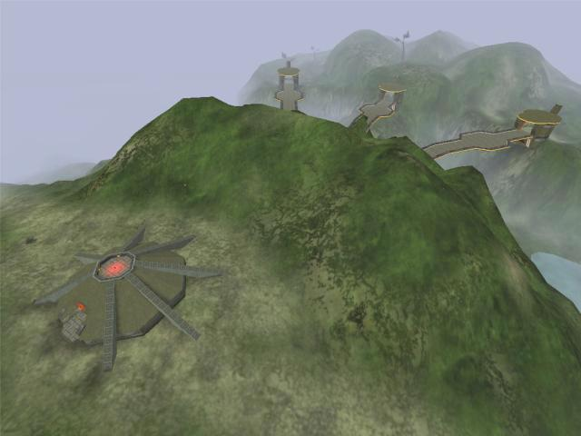
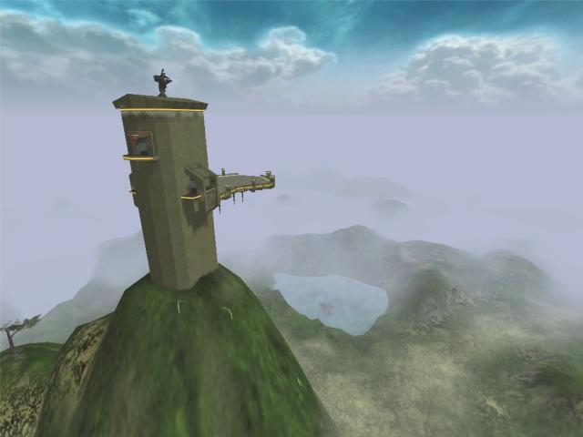
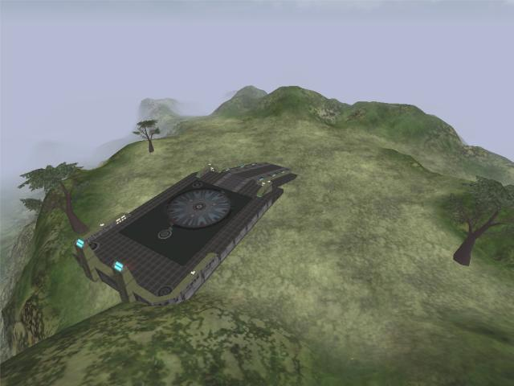
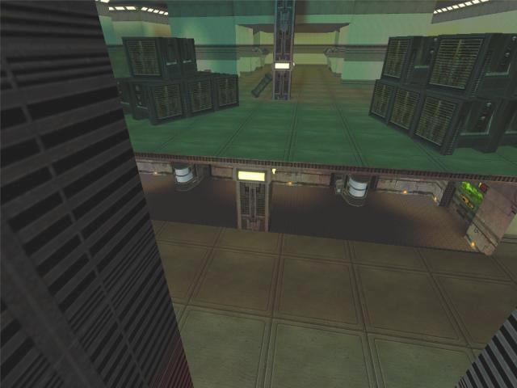

# Non Sequitur

## Installation

1. Download the [latest release](https://github.com/kfox/non-sequitur/releases/latest/download/NonSequitur.vl2)
2. Move it to your server's `Tribes2\GameData\base` directory
3. Start the server

## Description

This was my first Tribes 2 map. It relies on some unusual scripting. Unlike a typical Siege map, there are three capturable switches. Each time the map is loaded, it will choose three maps (at random) from the list of _all_ Siege maps loaded on your Tribes 2 server. Each of the three maps will be assigned to a different switch. The fastest switch capture determines which map will be loaded next.

Offense can repair the forward offense tower for better spawns. Main generators are not repairable.

Note that even though it is a Siege map, it is possible to allow selections from any available gametype by setting `$NonSequitur::EnableAllGameTypes = 1;` in the mission file or by overriding it elsewhere.

## Images

